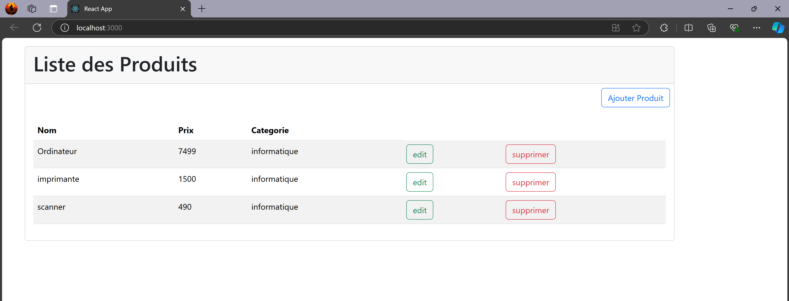
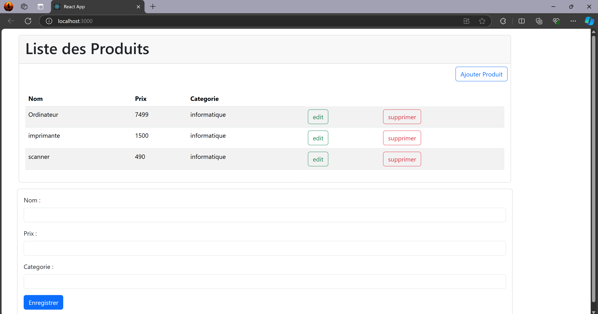

# React Product Management CRUD Application

This project is a **CRUD** (Create, Read, Update, Delete) application for managing products, built using **React**.
It allows users to perform basic operations such as creating new products, viewing a list of products, updating product details, and deleting products.
The application uses **Bootstrap** for styling.

## Features :

- **Add New Products**: Use a form to add new products with details like name, price, and category.
- **View Products**: Display a list of products with options to edit or delete.
- **Edit Products**: Update product details via a form.
- **Delete Products**: Remove products from the list.

## Setup and Running the Project :

1. **Install dependencies**: `npm install`
2. **Run the application** : `npm start`
This will open the application in your browser at `http://localhost:3000`.

## Project Structure :
- **App.js**: The main component that renders the product management interface.
- **Produit.js**: A component that manages the product listing, editing, and deletion.
- **App.css** : Contains styles for the app, using Bootstrap for layout and components.

##Screenshot :

